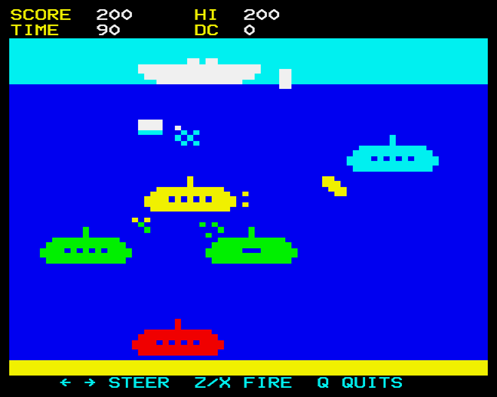
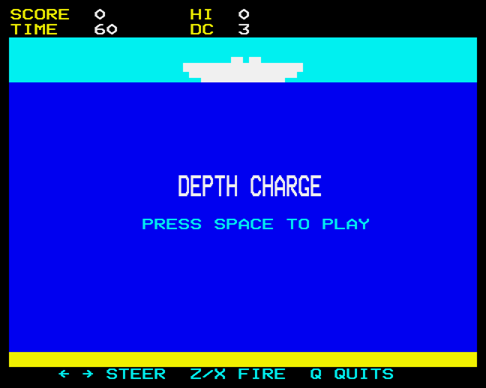

# Depth Charge (BBC Micro, Mode 7)

A BBC Micro port of [Depth Charge](https://github.com/dave-f/depth-charge), rendered
entirely in teletext — Mode 7, the Beeb's 1KB text mode, coaxed into being a game display.

The original is a PICO-8 take on the old arcade classic, also playable on the
[Lexaloffle BBS](https://www.lexaloffle.com/bbs/?tid=4045) (`load #depthcharge` in PICO-8).

<p align="center">
  
  
</p>

*Captured from jsbeeb by the headless test harness (`test/probe.mjs --png`).*

## Why Mode 7?

For the novelty, mostly. Teletext gives you 40×25 characters; with sixel graphics
characters that's an effective 80×75 "pixels", one colour per row without spending
character cells. A game of naval silhouettes in fixed horizontal lanes turns out to
fit those constraints surprisingly well — and background colour codes buy a blue
sea and cyan sky for three character cells a row.

## Status

Playable. Steer the ship, depth-charge the subs, dodge the mines they float up
at you; 60 seconds on the clock, +10 per kill, 20/50/80 points by sub type,
session high score. Compared to the original it fields 3 subs / 3 charges /
4 mines (the Beeb's 75 sixels of water want a less crowded ocean than 128px did)
but keeps the original's two fire keys: a charge is lobbed off the left or
right side of the ship, falls diagonally through the air and sinks straight
down once it hits the water, tumbling end over end as it goes.

Sound is in: four `ENVELOPE`s (sonar ping on the title, charge drop, explosion,
death), with a standalone audition menu on the disc (`CHAIN"SND"`). The original's
particle puffs are in too: a hit throws a few sixels up off the sub, a mine that
misses splashes at the surface. Design decisions and layout maths live in
[notes/design.md](notes/design.md).

## Controls

| Key | Action |
|---|---|
| `←` / `→` | steer ship left / right |
| `Z` / `X` | lob a depth charge off the left / right side (max 3 wet) |
| `SPACE` | start a game from the title |
| `Q` | quit to BASIC |

## How it works

- **Engine and rules** (`src/sixel.asm`, 6502 via BeebAsm): sixel
  plot/unplot, a data-driven sprite blitter with an opaque "move" mode (draw +
  self-erase in one pass — no tearing), and an object walker: a 20-slot table
  of fixed-point positions/velocities integrated, bounds-checked,
  collision-tested (ink-box overlap) and redrawn-on-move. One `frame` entry
  per game frame does the lot: locks to 25Hz by counting vsync events (EVNTV),
  scans the keys, steers, lobs charges, rolls each sub's mine launch (16-bit
  LFSR), runs the clock, then walks and collides. Subs respawn themselves, a
  sunk sub leaves a sinking wreck and a puff of particles (single sixels that
  share cells with the sprites without ever clearing a sprite's bit), and the
  TIME and DC fields are written straight into screen memory by a small
  number printer.
- **Director** (`src/game.bas`, BBC BASIC kept as plain text in git,
  tokenised onto the disc at build time by BeebAsm's `PUTBASIC`): scoring,
  sounds, the attract screen and the death sequence, driven by a flag byte
  and a short event queue from the machine code. Its frame loop is four
  statements. BBC BASIC turned out to manage roughly one statement a
  millisecond and 7-11ms for a `PRINT` with `STR$`, so anything that must
  happen every frame lives in the machine code. Measured: 50 frames per 100
  fields on a Model B and a Master, with kills the only frames that brush the
  40ms budget.
- **Test harness** (`test/probe.mjs`, Node): boots the disc headlessly in
  jsbeeb, plays a key script, dumps the Mode 7 screen as text, screenshots,
  and counts walker calls per field. `npm install` once, then e.g.
  `node test/probe.mjs --script "SPACE:3,.:60,Z:4,.:100" --rate 100 --txt`. Alongside
  it: `gaps.mjs` (BASIC work per frame type), `profile.mjs` (a BBC BASIC line
  profiler, sampling the interpreter's statement pointer), `bench.mjs`
  (statement costs) and `serve.mjs` (serve the disc to the public jsbeeb).
- Sprites are ported from the PICO-8 cart's sheet at 5/8 scale, hand-pixelled.

## Building / running

BeebAsm and b2 are expected in `tools/` (gitignored — grab
[beebasm](https://github.com/stardot/beebasm/releases) into `tools/beebasm/` and
[b2](https://github.com/tom-seddon/b2/releases) into `tools/b2/`). Then:

```powershell
.\build.ps1        # assemble build\depthcharge.ssd (bootable)
.\build.ps1 -run   # ...and boot it in b2
```

The `.ssd` also works in BeebEm, jsbeeb, or on real hardware from a Gotek/MMC.
